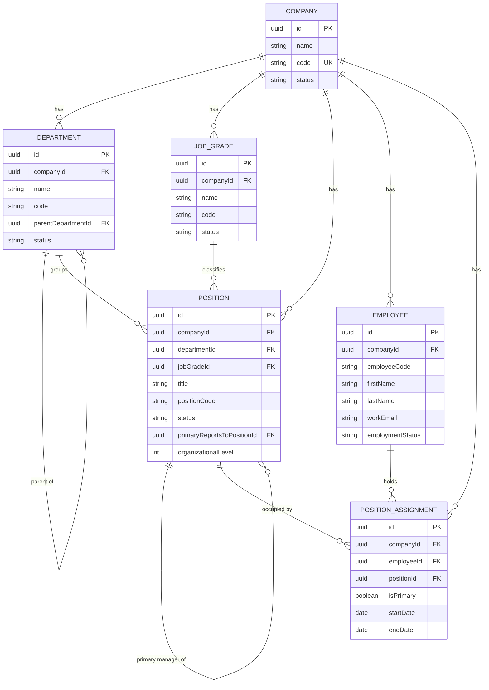

# Domain Model — Dynamic Organogram Manager

Narrative companion to `docs/DATA_DICTIONARY.md` (field-level reference) — this explains _why_ the model is shaped this way, not just what the fields are. Written for Phase 2 (Database and Core Domain Model); read alongside `docs/PROJECT_SPEC.md` §7 (Business Rules) and `.claude/skills/organogram-hierarchy-safety/SKILL.md`.

## 1. Domain Principles

1. The organogram is **position-based, not employee-based**.
2. A position exists independently of any employee.
3. Removing or transferring an employee never removes the position.
4. A position without an active employee assignment is vacant — vacancy is a _query result_, never a stored flag.
5. The primary hierarchy is position-to-position (`Position.primaryReportsToPositionId`), never employee-to-employee.
6. An employee's manager is derived: employee → their active position → that position's parent position.
7. Organizational level is derived from the primary reporting chain (root = 1, each hop down = +1).
8. Organizational level and job grade are unrelated concepts; neither is derived from the other.
9. Department and reporting hierarchy are related but distinct — a position's department groups/colors it on the chart; its manager position determines its place in the reporting tree. Moving a position between departments never changes who it reports to, and vice versa.
10. A position can belong to one department while reporting to a position in a different department (cross-department primary reporting is allowed — nothing in the approved documentation restricts this).
11. A hierarchy cycle (direct or indirect) is never allowed.
12. A position must not report to itself.
13. A position belonging to one company must not report to a position belonging to another company.
14. Secondary/dotted-line reporting is out of scope for this phase (`PositionAssignment.isPrimary` is reserved for it, but no dotted-line logic exists).
15. Planned positions are supported (`Position.status = PLANNED`) since Phase 0's proposal explicitly listed `PLANNED` as an approved status.
16. Historical organization snapshots and future-effective hierarchy planning are out of scope for this phase (Phase 0's Deferred Decisions list: "future-state organization planning," "historical organization comparison").

No conflict was found between these principles and existing approved documentation; where Phase 0's schema _sketch_ needed correction to match these principles (see §8), that correction is recorded as an amendment, not a silent change.

## 2. Entity Responsibilities

| Entity               | Responsibility                                                                                                                                              |
| -------------------- | ----------------------------------------------------------------------------------------------------------------------------------------------------------- |
| `Company`            | Scopes every other table. No business logic of its own beyond a name/code/status.                                                                           |
| `Department`         | Groups positions for display/color; optionally nested. Has its own parent-child hierarchy, entirely separate from the position reporting hierarchy.         |
| `JobGrade`           | HR's seniority/compensation-band classification. Purely descriptive metadata on a Position — never consulted by hierarchy logic.                            |
| `Position`           | The organogram's structural unit. Owns its department link, its job grade link, its manager link, and its computed level. Never owns an employee reference. |
| `Employee`           | A person record. Owns personal/employment fields. Never owns a position reference.                                                                          |
| `PositionAssignment` | The only link between `Employee` and `Position`. A row is a _tenure_: who held (or holds) which position, from when to when.                                |

## 3. Relationships

```
Company 1───* Department (self-referencing: parentDepartmentId, same-company only)
Company 1───* JobGrade
Company 1───* Position ──* department (Department, same-company)
                        ──? jobGrade (JobGrade, same-company, optional)
                        ──? primaryReportsTo (Position, self, same-company, optional — null only for the root)
Company 1───* Employee
Company 1───* PositionAssignment ──* employee (Employee, same-company)
                                  ──* position (Position, same-company)
```

Every cross-entity relationship that could theoretically span companies (`Position.department`, `Position.jobGrade`, `Position.primaryReportsTo`, `PositionAssignment.employee`, `PositionAssignment.position`) is a **composite foreign key** against `(id, companyId)` on the target table, not just `id`. A row in one company can never reference a row in another — the database itself refuses it (`docs/adr/0009-phase2-domain-model.md`).

## 4. Vacancy Calculation

A position is **occupied** at a moment in time iff an `isPrimary=true` `PositionAssignment` row exists for it whose `startDate <= moment` and (`endDate IS NULL` or `endDate > moment`). It is **vacant** otherwise — `endDate` is exclusive, so a position becomes vacant starting exactly on its assignment's end date, not the day after (matching the "vacant from the end date forward" language used throughout the UI, e.g. the End Assignment dialog). This is never a stored column — always a query (`lib/repositories/assignment.repository.ts`'s `getActivePrimaryAssignmentForPosition()`/`getActivePrimaryAssignmentForEmployee()`, `lib/repositories/position.repository.ts`'s `listOccupiedPositionIds()`, `lib/repositories/employee.repository.ts`'s `listCurrentAssignmentsForEmployees()`, and the pure helper `lib/domain/assignment.ts`'s `dateRangesOverlap()`/`rangeCoversDate()`/`isVacantOnDate()` — all fixed to this same exclusive-end convention in Phase 6, see `docs/DECISIONS.md` A18).

Why not store it: a stored `FILLED`/`VACANT` flag can drift from the real assignment data (an assignment ends and nobody remembers to flip the flag). Phase 0's own data dictionary already said the value should be "derived," but stored it as a literal enum member anyway — Phase 2 corrects this (`docs/DECISIONS.md`, C12 amendment).

A position's **status** (`PLANNED | ACTIVE | INACTIVE`) is a completely separate, HR-set lifecycle field. A `PLANNED` position is not yet part of the active structure regardless of any assignment; an `INACTIVE` position is no longer part of the active structure even if it still has an unended assignment on file (that assignment should be ended as part of deactivating the position — a future service-layer workflow concern, not a Phase 2 schema concern).

## 5. Organizational-Level Calculation

- Root position (the one position per company with `primaryReportsToPositionId = null`) = level 1.
- Every other position's level = its primary manager's level + 1.
- Computed in `lib/domain/hierarchy.ts` (`calculateLevel`, `recalculateSubtreeLevels`) — pure functions, no I/O — and persisted to `Position.organizationalLevel` by `lib/services/hierarchy.service.ts` inside the same transaction as the write that changed the hierarchy.
- **Never client-settable.** No service function accepts `organizationalLevel` as input; it's always computed from the parent's current level.
- Moving a position recalculates that position's level _and every descendant's level_, in one transaction (`movePosition()`).

## 6. Position Assignment Rules

1. An assignment's `endDate`, if present, must not be earlier than its `startDate` (DB `CHECK` constraint; also validated at the application layer before the query even runs, so the error is a clean `DomainValidationError`, not a raw constraint violation).
2. An employee and a position in the same assignment must belong to the same company (composite FKs).
3. At most one `isPrimary=true, endDate IS NULL` assignment may exist per position at a time (DB partial unique index — the database itself is the tiebreaker under concurrent writes).
4. At most one `isPrimary=true, endDate IS NULL` assignment may exist per employee at a time (same mechanism).
5. Two assignments for the same position must not have overlapping date ranges, including historical (fully-dated) ones — enforced at the application/transaction layer (`lib/services/assignment.service.ts`'s overlap check under a `SELECT ... FOR UPDATE` row lock), since a general date-range overlap constraint isn't expressible as a simple Postgres index the way the "currently open" case is.
6. Transferring an employee (ending one assignment, starting another) happens inside a single transaction — if the new assignment is invalid, the old one is never touched (rollback verified in `tests/integration/employee-and-assignment.integration.test.ts`).

## 7. Enforcement Layers (per rule)

| Rule                                                | Application layer                              | Transaction layer                                                 | Database layer                                                                          |
| --------------------------------------------------- | ---------------------------------------------- | ----------------------------------------------------------------- | --------------------------------------------------------------------------------------- |
| Position/Department code uniqueness                 | —                                              | —                                                                 | `@@unique([companyId, code])`                                                           |
| No self-report / no self-parent                     | —                                              | —                                                                 | `CHECK` constraint                                                                      |
| No direct/indirect reporting cycle                  | Ancestor-chain walk (`wouldCreateCycle`)       | Check + write in one transaction                                  | — (not expressible as a static constraint)                                              |
| No cross-company reference                          | —                                              | —                                                                 | Composite FK against `(id, companyId)`                                                  |
| One root position per company                       | —                                              | —                                                                 | Partial unique index (`primaryReportsToPositionId IS NULL`)                             |
| One active primary assignment per position/employee | Pre-check query (fast-fail with a clear error) | `SELECT ... FOR UPDATE` row lock serializes concurrent attempts   | Partial unique index is the ultimate backstop                                           |
| `endDate >= startDate`                              | Validated before the query                     | —                                                                 | `CHECK` constraint                                                                      |
| Overlapping historical date ranges                  | Overlap check against existing rows            | Row lock + check happen inside the same transaction as the insert | — (not expressible as a static constraint without a Postgres extension not in use here) |
| Safe deletion (no orphaned references)              | Pre-check for a clean error message            | —                                                                 | `ON DELETE RESTRICT` on every FK is the real guarantee                                  |

## 8. Deletion and Archival Behavior

- **Archive (`status = INACTIVE`), not delete**, is the normal workflow for Department and Position. It is always safe — the row persists, so every foreign key pointing at it remains valid, and the hierarchy stays structurally intact (an archived manager's direct reports still correctly point at it; the hierarchy is not broken, just showing a manager who is no longer active).
- **Hard delete exists only as a defensive/tested code path** (`deleteDepartment`, `deletePosition`), never exposed through a normal HR workflow. It is rejected by the database (`ON DELETE RESTRICT`) the moment any dependent row exists; the service layer pre-checks and translates that into a clean `UnsafeMutationError` rather than a raw Postgres error.
- **Removing/transferring/terminating an Employee never touches any Position row.** It only affects `Employee.employmentStatus` and ends the relevant `PositionAssignment` — the position itself, its code, and its place in the hierarchy are completely untouched.

## 9. Examples

**Valid:** Move "Engineering Manager, Platform" (currently reporting to "VP of Engineering") to report to "VP of Client Delivery" instead. Its department (`Platform Engineering`) does not change. Its level recalculates to match its new parent's level + 1. Every position that reported to "Engineering Manager, Platform" gets its level recalculated too, in the same transaction.

**Invalid — self-report:** Setting "VP of Engineering".`primaryReportsToPositionId` to its own id. Rejected by the database `CHECK` constraint even if application validation were somehow bypassed.

**Invalid — indirect cycle:** CEO → VP Engineering → Engineering Manager. Attempting to set CEO's manager to Engineering Manager. `lib/domain/hierarchy.ts`'s `wouldCreateCycle` walks Engineering Manager's ancestor chain (Engineering Manager → VP Engineering → CEO) and finds CEO in it — rejected before any write happens.

**Invalid — cross-company:** Company A's "Regional Director" position attempting to set its `primaryReportsToPositionId` to a position that belongs to Company B. The composite foreign key `(primaryReportsToPositionId, companyId)` → `positions(id, companyId)` has no matching row (Company B's position has a different `companyId`), so the database itself rejects the write.

**Valid — vacancy preserved:** "Head of People & Culture" has never had an assignment. It still appears in every position/hierarchy query — nothing about being vacant removes it from the result set (see the seed data and `tests/integration/employee-and-assignment.integration.test.ts`'s vacancy tests).

## 10. Mermaid ER Diagram



## 11. Assumptions and Deferred Capabilities

- **Assumption:** Department `color` (hex format) and Company `timezone` (IANA identifier) validity are application-layer checks, not database `CHECK` constraints — no user-facing input path exists yet to violate them (no CRUD UI ships until Phase 4).
- **Deferred:** Secondary/dotted-line reporting (`PositionAssignment.isPrimary` is reserved for it but unused).
- **Deferred:** Historical/point-in-time organization views and future-effective hierarchy planning.
- **Deferred:** Audit logging (`AuditLog` table doesn't exist yet — Phase 12).
- **Deferred:** Multi-tenant _access control_ — `companyId` scoping exists everywhere, but nothing yet prevents an application caller from passing an arbitrary `companyId`; that arrives with authentication (Phase 3), which will derive `companyId` from the authenticated session rather than trusting caller input.
- **Deferred:** Job-sharing / multiple simultaneous primary occupants per position — `docs/DECISIONS.md` P2 records the current one-primary-per-position/employee default and how to loosen it later without a schema change.
